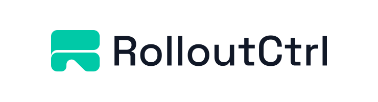
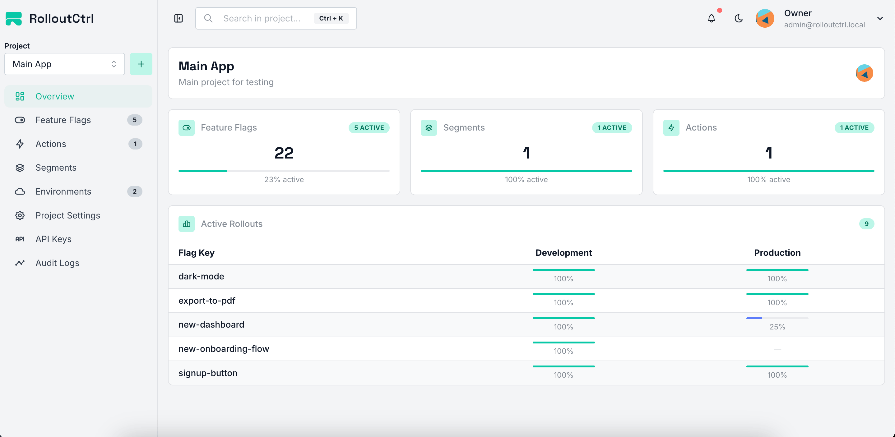

<div align="center">
<p align="center">
  <picture>
    <source srcset="./.github/logo-dark.svg" media="(prefers-color-scheme: dark)">
    <source srcset="./.github/logo-light.svg" media="(prefers-color-scheme: light)">
    
  </picture>
</p>


</div>

# RolloutCtrl

**Self-hosted feature flag & rollout platform** — control who sees which features, run A/B tests, and manage fine-grained access rules, all from a single dashboard. No vendor lock-in, no per-evaluation network calls.

---

## What is this?

RolloutCtrl is an open-source, self-hostable feature flag management service. It lets you:

- **Toggle features** on/off per environment without redeploying code
- **Target users** with rule-based strategies (country, subscription, custom attributes, segments)
- **Roll out gradually** with percentage-based rollouts and consistent bucketing
- **Run A/B tests** with weighted variants and sticky assignment
- **Control access** with "Actions" — flag-based authorization rules (ALLOW/DENY)
- **Track metrics** — flag exposures, strategy matches, variant assignments

It ships with a **React dashboard**, a **NestJS API**, and **SDKs** for JavaScript/TypeScript, React, Python, and Go.

## Dashboard

Manage feature flags, rollout strategies, environments, user segments, and access control through a modern web interface designed for development teams.

<p align="center">
  
</p>

The dashboard provides everything you need to safely release features:

- Create and manage feature flags
- Configure rollout strategies and percentage rollouts
- Create feature variants for A/B testing and gradual rollouts
- Organize projects, environments, and team members
- Manage roles and permissions with built-in RBAC
- Monitor feature usage and rollout activity
- Generate and manage SDK API keys

## Get started in 5 minutes

### Prerequisites

- **Docker** (for PostgreSQL + Redis) — or native installs
- **Node.js** 24+ (backend), 22+ (frontend)
- **Yarn** 1.x

### 1. Clone & start databases

```bash
git clone <repo-url> rolloutctrl
cd rolloutctrl
docker compose up -d          # starts PostgreSQL 18 + Redis 7
```

### 2. Configure environment

```bash
cp .env.selfhost.example .env
```

The defaults work for local dev. For production, change the JWT secrets.

### 3. Install, migrate, and seed

```bash
yarn install
yarn migrate:dev              # apply migrations + generate Prisma client
yarn prisma:seed              # creates org, admin user, sample project & flag
```

> **Prefer Docker?** You can skip steps 3–5 and run the entire stack (DB, Redis, backend, frontend) with a single command. See [One-command self-host (Docker)](#one-command-self-host-docker) below.

### 4. Start the backend

```bash
yarn start:dev                # API at http://localhost:3000/api
```

### 5. Start the frontend

```bash
cd frontend
yarn install
yarn dev                      # dashboard at http://localhost:5173
```

### 6. Log in

| Field    | Value                     |
| -------- | ------------------------- |
| Email    | `admin@rolloutctrl.local` |
| Password | `@Rollout123`             |

You're in. Create a project, add a feature flag, grab an API key, and start evaluating from your app.

### SDK Examples

Ready-to-run examples for all supported SDKs are available in the [`examples`](https://github.com/rolloutctrl/js-core/tree/main/examples) directory.

### One-command self-host (Docker)

Prefer the full stack in Docker?

```bash
cp .env.selfhost.example .env
docker compose -f docker-compose.selfhost.yml up -d --build
# Frontend: http://localhost:8080
# API:      http://localhost:8080/api
```

---

## Documentation

| Document                                   | Description                                                           |
| ------------------------------------------ | --------------------------------------------------------------------- |
| [Installation](docs/installation.md)       | Local development setup, prerequisites, project structure             |
| [Docker Deployment](docs/docker.md)        | Self-host deployment with Docker Compose, architecture, env vars      |
| [Feature Flags](docs/feature-flags.md)     | Core concepts: flags, strategies, segments, variants, evaluation flow |
| [SDK](docs/sdk.md)                         | Client & Server SDKs, evaluation API, metrics reporting               |
| [API Reference](docs/api.md)               | Full management & SDK endpoint documentation                          |
| [Permissions & Roles](docs/permissions.md) | Organization & team roles, permission codes, RBAC enforcement         |

---

## Tech stack

- **Backend:** NestJS 10, Prisma 7, PostgreSQL 18, Redis 7, BullMQ
- **Frontend:** React, Vite, Nginx
- **Auth:** JWT (access + refresh), bcrypt
- **SDKs:** `@rolloutctrl/js-sdk` (JS/TS), `@rolloutctrl/react-sdk` (React), `@rolloutctrl/node-sdk` (Node.js)

## Contributing

Contributions are welcome! Please read the [Contributing Guide](CONTRIBUTING.md) before opening an issue or submitting a pull request.

## License

This project is proprietary. See the [LICENSE](LICENSE) file for details.
