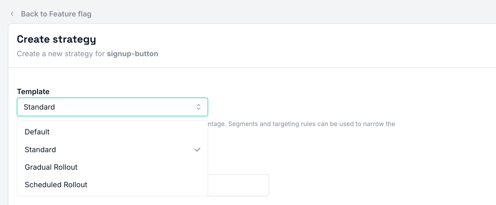
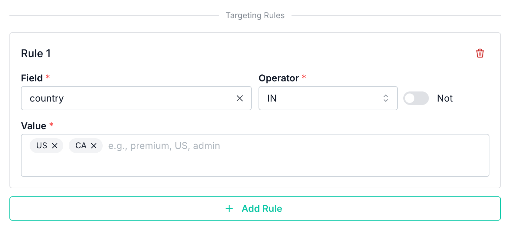
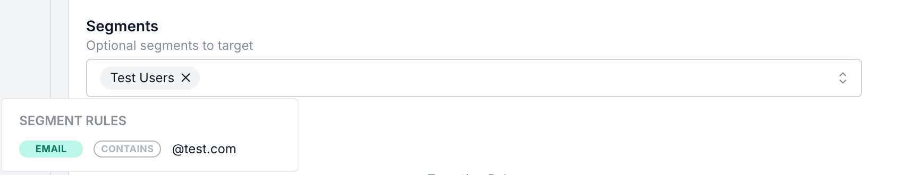
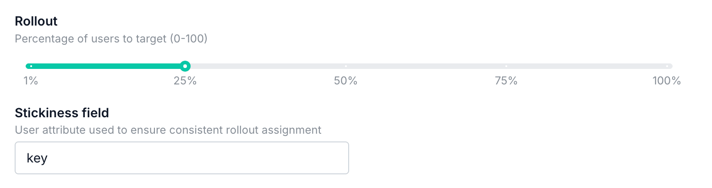
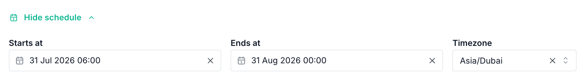
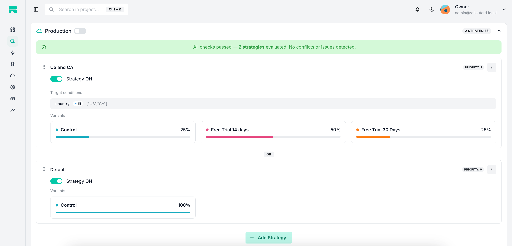
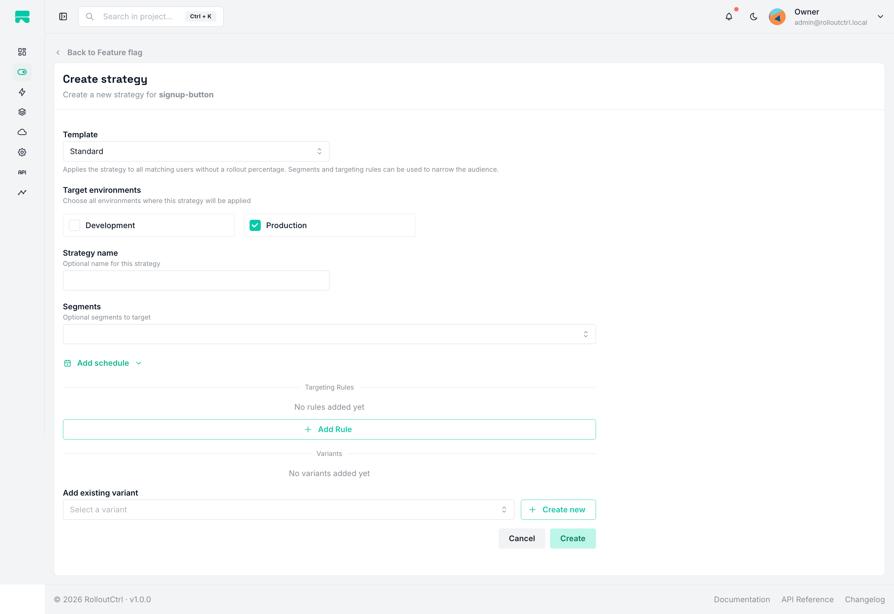
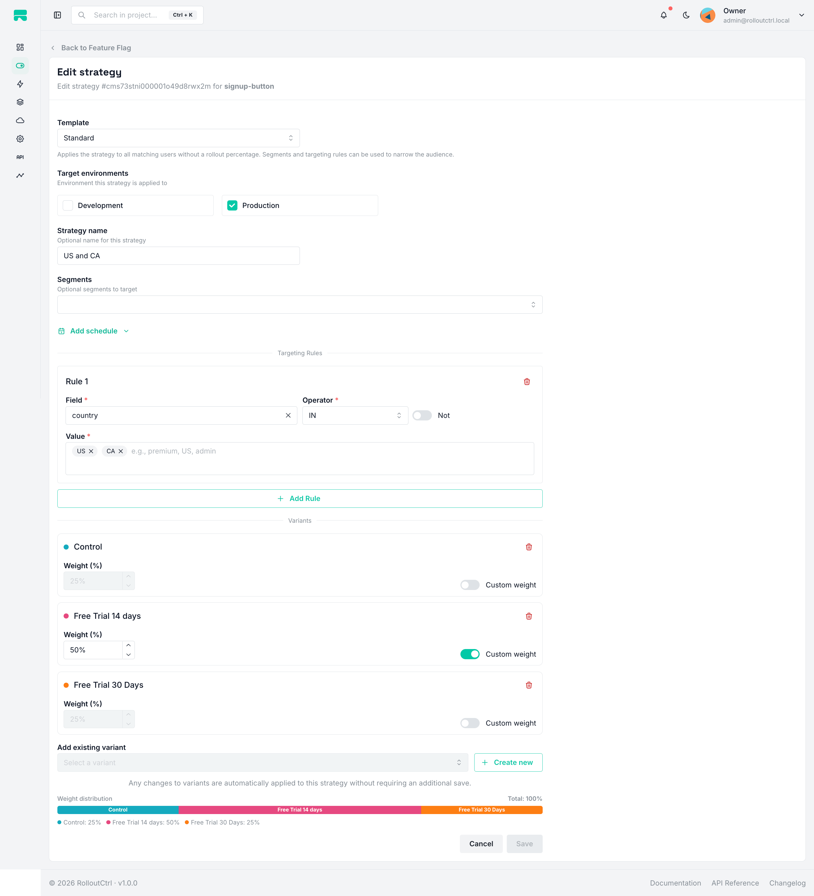
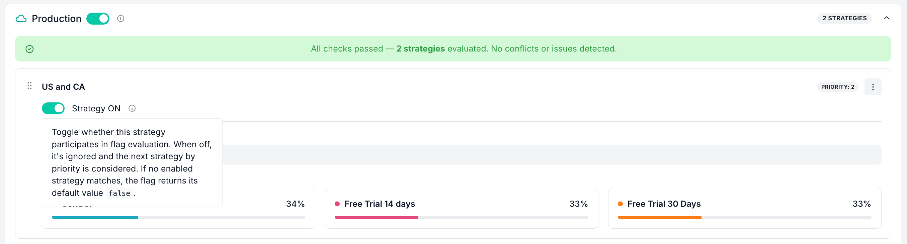

# Strategies

Strategies define **who** gets a feature flag. Each flag-environment combination
can have multiple strategies, evaluated in priority order. The first matching
strategy wins.

---

## Strategy templates

When creating a strategy in the dashboard, you choose a **template** that
pre-configures the relevant fields. You can then customize it further.

| Template | Description |
| --- | --- |
| **Default** | Passes 100% of all users. No segments, rollout percentage, or targeting rules can be specified. Only variants can be assigned. |
| **Standard** | Applies the strategy to all matching users without a rollout percentage. Segments and targeting rules can be used to narrow the audience. |
| **Gradual Rollout** | Gradually rolls out the strategy to a percentage of users. A stickiness field ensures consistent assignment for each user. |
| **Scheduled Rollout** | Rolls out the strategy to a percentage of users with a configurable start and end date. Useful for time-bound feature releases. |

<p align="center">
  
</p>

---

## Strategy properties

| Property | Type | Description |
| --- | --- | --- |
| `name` | `string?` | Human-readable name (hidden for Default template). |
| `enabled` | `boolean` | Whether the strategy is active (default `true`). |
| `priority` | `number` | Evaluation order — strategies are evaluated from highest to lowest priority. The first matching strategy wins. |
| `matchType` | `ALL` \| `ANY` | Whether **all** rules must match or **any** rule can match. Default: `ALL`. |
| `rolloutPercentage` | `number?` | Percentage of users who get the flag (0–100). Requires `rolloutStickinessField`. |
| `rolloutStickinessField` | `string?` | Field used for consistent hashing (e.g. `key` or `userId`). Ensures the same user always gets the same result. |
| `startsAt` | `DateTime?` | Schedule start (optional). Requires `timezone`. |
| `endsAt` | `DateTime?` | Schedule end (optional). Requires `timezone`. |
| `timezone` | `string?` | Timezone for interpreting the schedule (e.g. `Europe/Moscow`). Must be a valid IANA timezone. |
| `rules` | `StrategyRule[]` | Inline targeting rules (field + operator + value). |
| `segments` | `Segment[]` | Reusable targeting segments attached to the strategy. |
| `strategyVariants` | `StrategyVariant[]` | Variants with weights for A/B testing. See [Variants](variants.md). |
| `isDefault` | `boolean` | Marks this as the default strategy (only one per environment). |

---

## Targeting rules

Rules are conditions evaluated against the **evaluation context** provided by the
SDK. Each rule consists of a `field`, an `operator`, a `value`, and a `not` flag.

### Rule structure

```json
{
  "field": "country",
  "operator": "IN",
  "value": ["US", "CA", "GB"],
  "not": false
}
```

### Available operators

| Operator | Description | Example value |
| --- | --- | --- |
| `EQUALS` | Exact match | `"premium"` |
| `IN` | Value is in array | `["US", "CA", "GB"]` |
| `INCLUDES` | Array/string includes value | `"admin"` |
| `GT` | Greater than | `100` |
| `LT` | Less than | `50` |
| `GTE` | Greater than or equal | `18` |
| `LTE` | Less than or equal | `65` |
| `CONTAINS` | String contains substring | `"@test.com"` |
| `STARTS_WITH` | String starts with | `"user_"` |
| `ENDS_WITH` | String ends with | `".com"` |

All operators support the `not` flag to negate the condition.

### Match type

- **ALL** — all rules must match for the strategy to match (default).
- **ANY** — any single rule matching is enough.

### Predefined fields

The dashboard provides a set of predefined field suggestions (e.g. `userId`,
`country`, `email`, `subscription`). You can also type any custom field name —
it will be matched against the evaluation context you pass from your SDK.

<p align="center">
  
</p>

---

## Segments

Segments are **reusable** sets of rules that can be shared across multiple
strategies and flags. Instead of duplicating rules in every strategy, you create
a segment once and attach it to any strategy.

For example, a "Test Users" segment with an email domain rule
(`email CONTAINS @test.com`) can be attached to any strategy across any flag.

<p align="center">
  
</p>

---

## Rollout percentage & stickiness

When a strategy has a `rolloutPercentage` (e.g. 25%), only that percentage of
users will match. To ensure the **same user** always gets the same result, the
SDK uses a hash of the `rolloutStickinessField` (typically `key`):

```
hash(key) % 100 < rolloutPercentage → user gets the flag
```

This provides **consistent bucketing** — a user who gets the flag will always
get it until the percentage is increased or the flag is disabled.

### Gradual rollout workflow

1. Start with a low percentage (e.g. 5%)
2. Monitor metrics and errors
3. Gradually increase the percentage (10% → 25% → 50% → 100%)
4. Once at 100%, you can remove the rollout or convert to a Standard strategy

<p align="center">
  
</p>

---

## Scheduled rollouts

Strategies can be time-bound using `startsAt` and `endsAt` with a `timezone`:

- If current time is **before** `startsAt` → strategy doesn't match
- If current time is **after** `endsAt` → strategy doesn't match
- The `timezone` is used to interpret the schedule in the specified local time

Both `startsAt` and `endsAt` are optional, but at least one must be set if you
want scheduling. If `timezone` is not provided, it defaults to UTC.

<p align="center">
  
</p>

---

## Default strategy

Each flag-environment can have **one** default strategy. The default strategy:

- Passes 100% of all users
- Cannot have segments, targeting rules, or rollout percentage
- Can have variants assigned
- Serves as the fallback when no other strategy matches

If a default strategy already exists for an environment, attempting to create
another one will result in an error.

---

## Evaluation order

Strategies are evaluated in **priority order** (highest priority first). The
evaluation flow for each strategy:

```
1. Strategy disabled? → skip
2. Check schedule window (startsAt/endsAt) → skip if outside window
3. Evaluate targeting rules (with matchType ALL/ANY)
4. Evaluate segments
5. Check rollout percentage (if set)
6. First matching strategy wins
   ├─ Has variants? → assign variant by weight → return variant
   └─ No variants? → return { enabled: true, strategy }
```

If no strategy matches, the flag is disabled for that user (unless a default
strategy exists, which always matches).

<p align="center">
  
</p>

---

## Managing strategies

### Creating a strategy

1. Navigate to a feature flag page
2. Select the **Strategies** tab
3. Click **Create strategy**
4. Choose a template (Default, Standard, Gradual Rollout, Scheduled Rollout)
5. Select target environments
6. Configure rules, segments, rollout, and schedule as needed
7. Optionally assign variants
8. Click **Save**

<p align="center">
  
</p>

### Editing a strategy

1. Click on a strategy in the strategy list
2. Modify any fields (template, environments, rules, rollout, schedule, variants)
3. Click **Save**

When you change the target environments, the strategy is updated in the current
environment and **copied** to any newly selected environments.

<p align="center">
  
</p>

### Enabling / disabling a strategy

Use the toggle switch on the strategy card to enable or disable a strategy
without deleting it. Disabled strategies are skipped during evaluation.

<p align="center">
  
</p>

### Reordering strategies

Strategies are evaluated by priority. You can reorder them via drag-and-drop in
the strategy list or via the API.

### Deleting a strategy

1. Click the trash icon on the strategy card
2. Confirm the deletion

Deleted strategies are permanently removed. If the strategy was the only one
for a flag-environment, the flag's `enabled` state is used directly.

<p align="center">
  
</p>

---

## API endpoints

### Strategy management

| Method | Endpoint | Permission | Description |
| --- | --- | --- | --- |
| `POST` | `/api/strategies` | `flag.strategy.create` | Create a strategy |
| `GET` | `/api/strategies/environment/:featureFlagEnvironmentId` | `flag.strategy.read` | List strategies for a flag-environment |
| `GET` | `/api/strategies/:strategyId` | `flag.strategy.read` | Get a single strategy |
| `PATCH` | `/api/strategies/:strategyId` | `flag.strategy.update` | Update a strategy |
| `POST` | `/api/strategies/:strategyId/toggle-enable` | `flag.strategy.toggle` | Enable/disable a strategy |
| `DELETE` | `/api/strategies/:strategyId` | `flag.strategy.delete` | Delete a strategy |
| `PATCH` | `/api/strategies/environment/:featureFlagEnvironmentId/reorder` | `flag.strategy.update` | Reorder strategies |

### Strategy rules

| Method | Endpoint | Permission | Description |
| --- | --- | --- | --- |
| `POST` | `/api/strategies/rules` | `flag.strategy.update` | Create a rule |
| `GET` | `/api/strategies/:strategyId/rules` | `flag.strategy.read` | List rules for a strategy |
| `PATCH` | `/api/strategies/rules/:ruleId` | `flag.strategy.update` | Update a rule |
| `DELETE` | `/api/strategies/rules/:ruleId` | `flag.strategy.delete` | Delete a rule |

### Create strategy request body

```json
{
  "projectId": "project_id_or_slug",
  "featureFlagEnvironmentIds": ["env_id_1", "env_id_2"],
  "name": "Gradual Rollout",
  "rolloutPercentage": 25,
  "rolloutStickinessField": "key",
  "segmentIds": ["segment_id_1"],
  "priority": 1,
  "isDefault": false,
  "timezone": "Europe/Moscow",
  "startsAt": "2025-01-01T00:00:00.000Z",
  "endsAt": "2025-02-01T00:00:00.000Z",
  "rules": [
    {
      "field": "country",
      "operator": "IN",
      "value": "[\"US\", \"CA\"]",
      "not": false
    }
  ]
}
```

### Update strategy request body

All fields are optional (partial update):

```json
{
  "projectId": "project_id_or_slug",
  "featureFlagEnvironmentIds": ["env_id_1"],
  "name": "Updated Rollout",
  "rolloutPercentage": 50,
  "rolloutStickinessField": "key"
}
```

---

## Permissions

| Permission code | Description |
| --- | --- |
| `flag.strategy.create` | Create a strategy |
| `flag.strategy.read` | View strategies |
| `flag.strategy.update` | Edit a strategy, manage rules and variants |
| `flag.strategy.toggle` | Enable/disable a strategy |
| `flag.strategy.delete` | Delete a strategy |

See [Permissions & Roles](permissions.md) for role mappings.

---

## Common use cases

### Targeting specific users

Create a **Standard** strategy with rules:

```json
{
  "rules": [
    { "field": "email", "operator": "CONTAINS", "value": "@company.com" }
  ]
}
```

### Gradual rollout to premium users

Create a **Gradual Rollout** strategy:

```json
{
  "rolloutPercentage": 25,
  "rolloutStickinessField": "key",
  "rules": [
    { "field": "subscription", "operator": "EQUALS", "value": "premium" }
  ]
}
```

### Time-bound release

Create a **Scheduled Rollout** strategy:

```json
{
  "rolloutPercentage": 100,
  "rolloutStickinessField": "key",
  "startsAt": "2025-01-01T00:00:00.000Z",
  "endsAt": "2025-02-01T00:00:00.000Z",
  "timezone": "Europe/Moscow"
}
```

### Excluding beta testers

Use the `not` flag on a rule:

```json
{
  "rules": [
    { "field": "betaTester", "operator": "EQUALS", "value": "true", "not": true }
  ]
}
```

### Multiple strategies with priority

1. **Strategy 1** (priority 2): Target internal team — `email CONTAINS @internal.com`
2. **Strategy 2** (priority 1): Gradual rollout to 25% of all users

Internal team members always get the flag (Strategy 1 matches first). Everyone
else is evaluated against the gradual rollout (Strategy 2).
