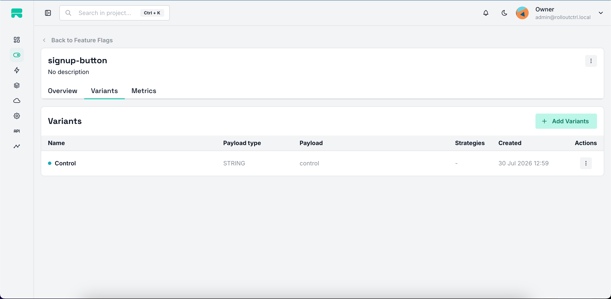
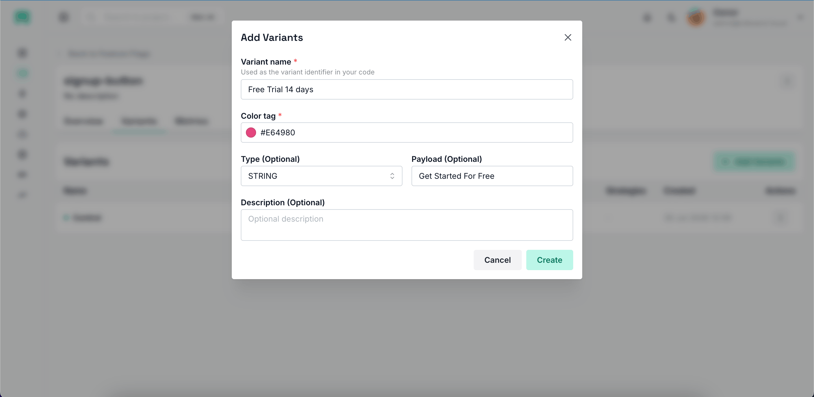
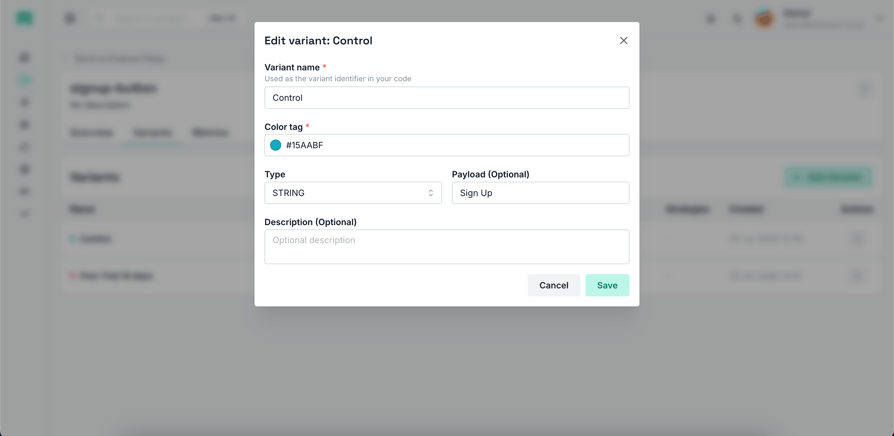
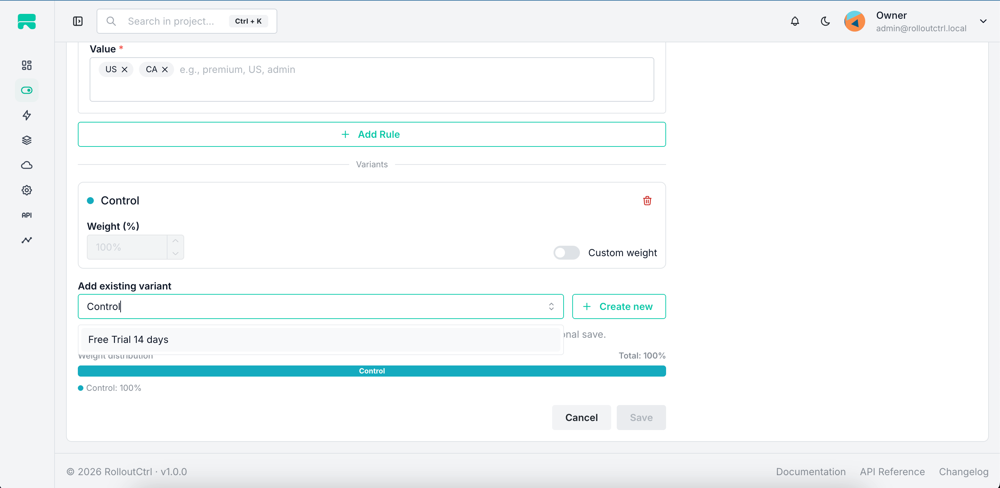
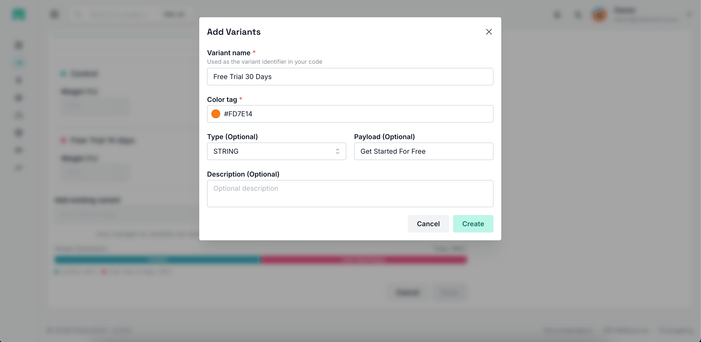
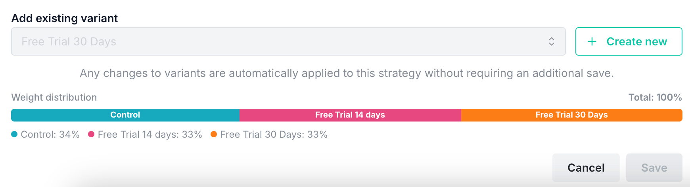
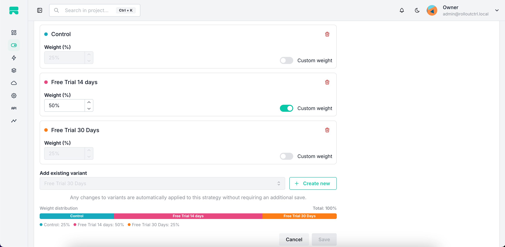

# Variants

Variants enable A/B testing and controlled experimentation within RolloutCtrl.
A variant is a named configuration option attached to a feature flag. When a
strategy matches a user, the variant is assigned based on **weights**, providing
sticky, consistent bucketing.

---

## Core concepts

### Variant

A variant belongs to a **feature flag** (not to a specific environment). Once
created, it can be added to any strategy across any environment for that flag.

| Property | Type | Description |
| --- | --- | --- |
| `name` | `string` | Variant identifier (e.g. `control`, `treatment`). Must be unique per feature flag. |
| `description` | `string?` | Optional human-readable description. |
| `payloadType` | `enum?` | `STRING`, `NUMBER`, `BOOLEAN`, or `JSON`. Must be provided together with `payload`. |
| `payload` | `string?` | The value delivered to the SDK when this variant is assigned. |
| `colorTag` | `string` | Hex color for visual identification in the UI. Must be one of the predefined colors. |
| `isArchived` | `boolean` | Soft-delete flag (default `false`). |

### StrategyVariant

A `StrategyVariant` is the link between a **strategy** and a **variant**. It
holds the weight and weight mode for that variant within the strategy.

| Property | Type | Description |
| --- | --- | --- |
| `strategyId` | `string` | The strategy this link belongs to. |
| `variantId` | `string` | The variant being linked. |
| `weight` | `number` | Percentage weight (0–100). |
| `isCustomWeight` | `boolean` | If `true`, the weight is manually set. If `false`, the weight is auto-distributed equally among non-custom variants. |
| `isArchived` | `boolean` | Soft-delete flag (default `false`). |

A strategy can have **up to 5 variants** (`MAX_VARIANTS`).

---

## Available color tags

Variants are assigned a color from a predefined palette for visual
identification in the dashboard:

| Color name | Hex |
| --- | --- |
| cyan | `#15AABF` |
| pink | `#E64980` |
| orange | `#FD7E14` |
| grape | `#BE4BDB` |
| teal | `#0CA678` |
| yellow | `#FAB005` |
| indigo | `#4C6EF5` |
| lime | `#82C91E` |

---

## Payload types

Each variant can optionally carry a payload. The `payloadType` determines how
the payload is interpreted by the SDK:

| Type | Description | Example payload |
| --- | --- | --- |
| `STRING` | Plain string value | `"checkout_v2"` |
| `NUMBER` | Numeric value | `42` |
| `BOOLEAN` | True/false | `true` |
| `JSON` | JSON object (validated) | `{"color": "blue"}` |

> `payload` and `payloadType` must always be provided together. Omitting both
> is valid (no payload), but providing only one results in a validation error.

---

## Weight distribution

### Equal weights (default)

When no variant has `isCustomWeight` enabled, weights are distributed **equally**
among all variants. For example, with 3 variants: 34% / 33% / 33%.

### Custom weights

When `isCustomWeight` is enabled for a variant, its weight is manually
controlled. The remaining weight is distributed equally among non-custom
variants.

Example with 3 variants where one has a custom weight of 50%:

| Variant | isCustomWeight | Weight |
| --- | --- | --- |
| Control | `false` | 25% |
| Treatment A | `true` | 50% |
| Treatment B | `false` | 25% |

### Weight constraints

- Total custom weight sum **cannot exceed 100**.
- Only one variant can have `isCustomWeight` enabled at a time (toggling it on
  for one variant disables it for others).
- Non-custom variants automatically receive the remaining weight split equally.

### Automatic redistribution

The backend automatically redistributes non-custom weights whenever:

- A variant is **added** to a strategy
- A variant is **removed** from a strategy
- A variant's custom weight is **updated** or **toggled**
- A variant is **deleted** (removed from all linked strategies)

---

## Managing variants

### Creating a variant

You can create a variant in two ways:

1. **From the Variants tab** on a feature flag page — creates a standalone
   variant that can later be added to any strategy.
2. **From within a strategy** — create a new variant and immediately add it to
   the strategy.

<p align="center">
  
</p>

<p align="center">
  
</p>

**Fields:**

- **Variant name** (required) — used as the identifier in your code
- **Color tag** (required) — select from the predefined palette
- **Type** (optional) — payload type: `STRING`, `NUMBER`, `BOOLEAN`, or `JSON`
- **Payload** (optional) — the value to deliver (required if type is selected)
- **Description** (optional)

### Editing a variant

Editing a variant updates it across **all strategies** that reference it. You
can change the name, description, payload type, payload value, and color tag.

<p align="center">
  
</p>

### Deleting a variant

Deleting a variant:

1. Removes it from **all strategies** it's linked to
2. Redistributes weights for each affected strategy
3. Permanently deletes the variant record

> **Warning**: Deletion is irreversible. If a variant is being served to
> users, they will be reassigned to remaining variants.

<p align="center">
  
</p>

---

## Adding variants to strategies

### Adding an existing variant

From the strategy edit page, use the **"Add existing variant"** dropdown to
select from variants already created for this feature flag. Variants already
added to the strategy are filtered out.

<p align="center">
  
</p>

### Creating a new variant from a strategy

Click **"Create new"** to open the variant creation modal. The variant is
created for the feature flag and immediately added to the strategy.

<p align="center">
  
</p>

### Batch adding variants

The API supports adding multiple variants to a strategy in a single request
(see [API Reference](api.md)). This is useful for initial setup.

---

## Weight management in the UI

### Weight distribution bar

The strategy page displays a visual **weight distribution bar** showing each
variant's share with its color. The total is displayed as a percentage — it
turns red if it doesn't sum to 100%.

<p align="center">
  
</p>

### Custom weight toggle

Each variant card has a **"Custom weight"** switch:

- **Off** (default): weight is auto-calculated (equal split among non-custom
  variants)
- **On**: weight is manually editable via the number input

When you enable custom weight for a variant, all other variants automatically
switch to non-custom mode and their weights are recalculated.

<p align="center">
  
</p>

### Removing a variant from a strategy

Click the trash icon on a variant card to remove it from the strategy. The
variant itself is **not deleted** — it remains available for other strategies.
Weights are recalculated for the remaining variants.

---

## Evaluation & sticky assignment

When a strategy with variants matches a user:

1. The SDK hashes the `rolloutStickinessField` (typically `userId`) to
   deterministically assign a variant
2. The same user always gets the **same variant** (sticky bucketing)
3. The assigned variant's `payload` is returned to the SDK

Example evaluation response:

```json
{
  "enabled": true,
  "reason": "STRATEGY_MATCH",
  "variant": {
    "name": "treatment",
    "payload": "new-ui",
    "payloadType": "STRING"
  }
}
```

---

## Metrics

RolloutCtrl tracks variant exposure metrics:

| Metric | Description |
| --- | --- |
| `VARIANT_EXPOSURE` | How often each variant was assigned during evaluation |

Metrics are aggregated into daily buckets and viewable in the dashboard.

---

## API endpoints

### Variant management

| Method | Endpoint | Permission | Description |
| --- | --- | --- | --- |
| `GET` | `/api/variants/flag/:flagId?projectId=...` | `variant.read` | List all variants for a feature flag |
| `GET` | `/api/variants/:variantId` | `variant.read` | Get a single variant by ID |
| `POST` | `/api/variants/flag/:flagId` | `variant.create` | Create a new variant |
| `PATCH` | `/api/variants/:variantId` | `variant.update` | Update a variant |
| `DELETE` | `/api/variants/:variantId` | `variant.delete` | Delete a variant |

### Strategy variant management

| Method | Endpoint | Permission | Description |
| --- | --- | --- | --- |
| `GET` | `/api/strategies/:strategyId/variants` | `flag.strategy.read` | List variants for a strategy |
| `POST` | `/api/strategies/:strategyId/variants` | `flag.strategy.update` | Add a variant to a strategy (existing or new) |
| `POST` | `/api/strategies/:strategyId/variants/batch` | `flag.strategy.update` | Batch add variants to a strategy |
| `PATCH` | `/api/strategies/:strategyId/variants/:variantId` | `flag.strategy.update` | Update weight / custom weight |
| `DELETE` | `/api/strategies/:strategyId/variants/:variantId` | `flag.strategy.update` | Remove a variant from a strategy |

### Create variant request body

```json
{
  "name": "treatment",
  "colorTag": "#E64980",
  "description": "New checkout UI",
  "payloadType": "STRING",
  "payload": "checkout_v2",
  "featureFlagId": "flag_id_or_key",
  "projectId": "project_id_or_slug"
}
```

### Add variant to strategy request body

Add an **existing** variant:

```json
{
  "variantId": "variant_id",
  "weight": 50,
  "isCustomWeight": true
}
```

Create a **new** variant and add it:

```json
{
  "name": "treatment",
  "colorTag": "#E64980",
  "payloadType": "STRING",
  "payload": "checkout_v2",
  "weight": 50,
  "isCustomWeight": true
}
```

### Update strategy variant request body

```json
{
  "weight": 75,
  "isCustomWeight": true
}
```

---

## Permissions

| Permission code | Description |
| --- | --- |
| `variant.create` | Create a new variant |
| `variant.read` | View variants |
| `variant.update` | Edit a variant |
| `variant.delete` | Delete a variant |

Strategy variant management uses `flag.strategy.read` and `flag.strategy.update`
permissions. See [Permissions & Roles](permissions.md) for role mappings.

---

## Common use cases

### A/B test: 50/50 split

1. Create two variants: `control` and `treatment`
2. Add both to a strategy
3. Leave custom weight off — they'll be split 50/50 automatically

### A/B test: 80/20 split

1. Create two variants: `control` and `treatment`
2. Add both to a strategy
3. Enable custom weight on `control` and set it to 80%
4. `treatment` automatically gets 20%

### Gradual rollout with variants

1. Create a strategy with `rolloutPercentage: 10`
2. Add variants with desired weights
3. As you increase the rollout percentage, more users are exposed to the
   variant distribution

### Feature flag with payload delivery

1. Create a variant with `payloadType: JSON` and
   `payload: {"theme": "dark", "layout": "compact"}`
2. Add it to a strategy (optionally alongside a control variant)
3. The SDK receives the payload and your code can use it directly

---

## Running experiments

RolloutCtrl assigns variants but does not analyze experiment results itself.
To measure conversions and funnels, forward the assigned variant to your
existing analytics platform (Google Analytics, PostHog, Amplitude, Segment,
etc.). See [Experiments & analytics integration](experiments.md) for
end-to-end examples in React and Node.js.
